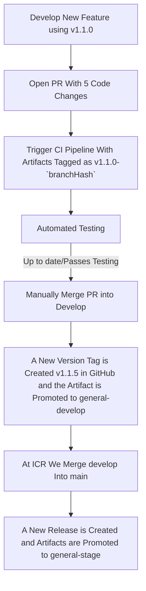

# Contributing to mlopster

Thanks for taking the time to consider contributing! We very much appreciate
your time and effort. This document outlines the many ways you can contribute
to our project, and provides detailed guidance on best practices.
We look forward to your help!

## Prerequisites

Before you begin contributing to our project, it'll be a good idea to ensure
you've satisfied the below prerequisites.

### Code of Conduct

Our Code of Conduct helps facilitate a positive interaction environment for
everyone involved with the team, and provides guidance on what to do if you
experience problematic behavior. Read more in our
[CODE_OF_CONDUCT.md](CODE_OF_CONDUCT.md), and make sure you agree to its terms.

### Developer Environment

For patch contributions, see our
[Developer Documentation]([INSERT YOUR DEVELOPMENT GUIDE LINK HERE]) for more
details on how to set up your local environment, to best contribute to our
project.

At a minimum however to submit a pull request (if using Git), you'll want to
ensure you have:

1. An account on the Version Control System our project uses (i.e. JPL's GitHub Enterprise).
2. The Version Control System client (i.e. Git) installed on your local machine.
3. The ability to edit, build, and test our project on your local machine. Again, see our [README.md](README.md) or detailed developer guide for more details.

### Communication Channels

Before contributing changes to our project, it's a great idea to be familiar
with our communication channels and to socialize your potential contributions to
get feedback early. This will help give you context for your contributions,
no matter their form.

Our communication channels are:

- [Issue tracking system](https://jira.jpl.nasa.gov/projects/mlopster) - a regularly monitored area to report issues with our software or propose changes
- Microsoft Teams: mlopster Team - an permanently archived place to hold conversations related to our project. This resource can be searched for old discussions.

## Our Development Process

Our project integrates contributions from many people, and so we'd like to outline a process you can use to visualize how your contributions may be integrated if you provide something.


### Our Versioning and Tagging Process



### Create a Branch

Our project typically has the following branches available, make sure to branch off either the default branch or a branch someone else already tagged with a particular issue ticket you're working with. This project follows the [GitFlow Branching Strategy](https://datasift.github.io/gitflow/IntroducingGitFlow.html).

- `develop` - default branch
- `main` - release branch

### Make Your Modifications

Within your local development environment, this is the stage at which you'll propose your changes, and commit those changes back to version control. See the [README.md](README.md) or development guide for more specifics on what you'll need as prerequisites to setup your local development environment.

#### Commit Messages

Commit messages to version control should reference a ticket in their title / summary line:

```shell
mlopster-1234: Add exponential backoff with jitter
```

This makes sure that tickets are updated on GitHub with references to commits that are related to them.

Commit should always be atomic. Keep solutions isolated whenever possible. Filler commits such as "clean up white space" or "fix typo" should be merged together before making a pull request, and significant sub-feature branches should be [rebased](https://www.youtube.com/results?search_query=git+rebase) to preserve commit history. Please ensure your commit history is clean and meaningful!

### Submit a Pull Request

Navigate to your branch within the version control system, and submit a pull request or submit the patch text to our project. Please make sure to provide a meaningful text description to your pull requests, whenever submitted. Our pull-request template will be auto-generated for you when you create your pull-request. See the template [here](.github/PULL_REQUEST_TEMPLATE.md).

### Reviewing Your Pull Request

Reviewing pull-requests, or any kinds of proposed patch changes, is an art. That being said, we follow the following best practices:

- **Intent** - is the purpose of your pull-request clearly stated?
- **Solution** - is your pull-request doing what you want it to?
- **Correctness** - is your pull-request doing what you want it to _correctly_?
- **Small Patches** - is your patch of a level of complexity and brevity that it can actually be reviewed by a human being? Or is does it involve too much content for one pull request?
- **Coding best practices** - are you following best practices in the coding / contribution language being used?
- **Readability** - is your patch readable, and ultimately maintainable, by others?
- **Reproducibility** - is your patch reproducible by others?
- **Tests** - do you have or have conducted meaningful tests?

## Documentation

Documentation is the core way our users and contributors learn about the project. We place a high value on the quality, thoroughness, and readability of our documentation. Writing or editing documentation is an excellent way to contribute to our project without performing active coding.

Some guidelines for documentation best practices (summarized from Google's [excellent documentation guide](https://google.github.io/styleguide/docguide/best_practices.html)):

- **Minimum viable docs** - don't do less documentation than your users / developers need, but also don't do more
- **Changed code = changed docs** - if your code has changed, remember to update your documentation
- **Delete old docs** - continually clean your documentation tree, and remove outdated docs regularly

### Documentation Organization

The overall structure of our project documentation is as follows:

- Source-controlled documentation
  - [README.md](README.md) - top-level information about how to run, build, and contribute to the project
  - [CODE_OF_CONDUCT.md](CODE_OF_CONDUCT.md) - best practices and guidance on how to work well with other people in the project, and suggestions on dealing with interpersonal issues
  - [CONTRIBUTING.md](CONTRIBUTING.md) - guidance on contributing to the project
  - `*.py` - inline documentation available inside code files' function headers and code blocks
  - [docs/](docs/)` - top-level directory containing source-controlled documentation built into statically hosted files.
- Hosted documentation
  - [Wiki](https://wiki.jpl.nasa.gov/display/mlopster)

### Writing Style

To ensure documentation is readable and consistent by newcomers and experts alike, here are some suggestions on writing style for English:

- Use gender neutral pronouns (they/their/them) instead of he/she/his/her
- Avoid qualifiers that minimize the difficulty of a task at hand, e.g. avoid words like “easily”, “simply”, “just”, “merely”, “straightforward”, etc. Readers' expertise may not match your own, and qualifying complexity may deter some readers if the task does not match their level of experience. That being said, if a particular task is difficult or complex, do mention that.

### Common Wording

Below are some commonly used words you'll want to leverage in your documentation contributions:

- **GitHub** - one word, and capitalization of the 'G' and the 'H'

### Inline Code Documentation

For language-specific guidance on code documentation, including style guides, see [Google's list of language style guides](https://google.github.io/styleguide/) for a variety of languages.

Additionally, take a look at Google's recommendations on [inline code documentation](https://google.github.io/styleguide/docguide/best_practices.html#documentation-is-the-story-of-your-code) for best practices.

### Media

Media, such as such as images, videos, sound files, etc., are an excellent way to explain documentation to a wider audience more easily. Include media in your contributions as often as possible.

When including media into our version-control system, it is recommended to use formats such as:

- Diagrams: [Mermaid](https://mermaid-js.github.io/mermaid/#/) format
- Images: JPEG format
- Videos: H264 MPEG format
- Sounds: MP3 format

Media files such as these should be stored in [`docs/images/`](docs/images/), a top-level directory containing source-controlled documentation built into statically hosted files.
